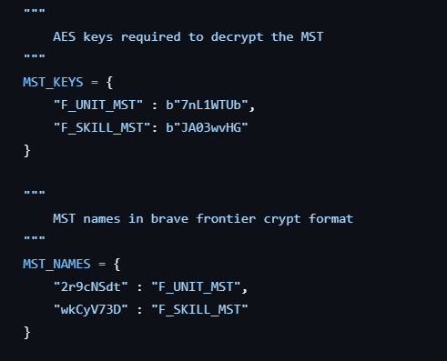
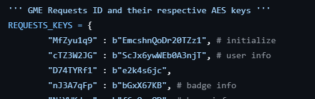

Decrypting and Writing a new packet or MST
=============================================

In Brave Frontier, we can assume that all JSON files (both local/remote MST or networking packets)
are encrypted with AES and a specific key, this page will guide you in adding a new
packet to the server, doucmentation or any other project that is based of the decompfrontier
packet generator infrastructure.

Using the scripts for initial analysis
-----------------------------------------

Once you have found and researched a new MST or packet you would like to add but you have yet to read
or test, you might find the `script repository <https://github.com/decompfrontier/scripts>`_ usefull for such purpose.

To use the scripts repository, you must have Python3 installed.

Run:

    pip install -r requirements.txt

to install the relative dependencies of the script repository.

Adding a new MST to the script
^^^^^^^^^^^^^^^^^^^^^^^^^^^^^^^^^^^

You might want to run `python mstdec.py (your mst.dat)` first to see if the MST you are
trying to read is already supported.

If the script does not work, then you might have to add the MST to the mstdec.py file, opening
such file you will find this two dictionaires:

The dictionary MST_NAMES maps the Brave Frontier hashed file name found in the MST
directory to the proper decoded file name that is, for example, used in the MstInfo
response. Once you have found the corrispective local MST file, add a new data in
the dictionary following the ones already existing.

The dictionary MST_KEYS maps the MST names with their corrispective AES key for decryptation.
Once you have found the AES key, add a new data in the dictionary following the ones already existing.

You are required to add a new entry for both MST_NAMES and MST_KEYS or the script will not work.

Once your modifications are done, run the mstdec.py script again, you should find a JSON file
formatted as `(MST decoded name like F_UNIT_MST)_(Mst version)_(Mst part).json`

Adding a new Network packet to the script
^^^^^^^^^^^^^^^^^^^^^^^^^^^^^^^^^^^^^^^^^^^^^^

You might want to run `python networkdecr.py` first and follow the instructions on
screen to see if the network packet you are trying to read is already supported.

If the script does not work, then you might have to add a new AES key to the networkdecr.py, 
opening such file you will find the following dictionary:

The dictionary REQUEST_KEYS maps the Brave Frontier GME request with the
specific AES key to decrypt the request.

Once you have found the AES key of the request or response you want to decode,
simply add a new data in the dictionary following the ones already existing.

Adding the data in the packet-generator repository
--------------------------------------------------------

Once you are confident you have documented a packet or MST (even partially) and
you wish to add it to the decompfrontier documentation or server, you should now
clone the `packet-generator repository <https://github.com/decompfrontier/packet-generator>`_
repository, remember to install the required dependencies by running the following
command:

    pip install -r requirements.txt

