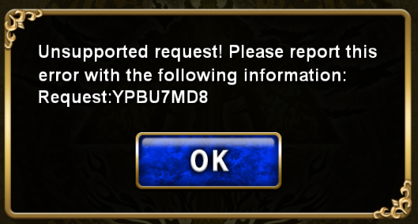

Game Server
===================

The game server (GME) is the main server which all the actions of Brave Frontier are done.

The original server was written in PHP (according to a leak of one misconfigured file) as a REST api, 
each key of the JSON are not written in plaintext, rather they seems to be an hash of the field name,
this is presumably done to complex the analysis of the packets.

The flow of a GME packet follows as this file: (apply the opposite for reading one)

.. info::

    The AES cryptation key changes based from the Game request.

.. image::
    ../../../images/gme_flow.png

1. The actual JSON packet gets created by the client
2. The packet is crypted with AES/ECB and encoded in Base-64 with a key that changes for every request type
3. The encrypted JSON is then embedded in a GME JSON

This is what a completed GME packet looks like:

.. code::
    
    {
        "F4q6i9xe": {
            "aV6cLn3v": "Client ID that send the request",
            "Hhgi79M1": "Game request"
    },
        "a3vSYuq2": {
            "Kn51uR4Y": "Encrypted JSON body"
        }
    }

Understanding Game Client Requests
-------------------------------------------

As you navigate around in the game, you may have came across something akin to the below screen:

This can happen when the client sends a game request that the server does not recognize or support. In the above example, 
the client sent a game request with the ID ``YPBU7MD8`` which the server does not have a handler for.

For a more concrete example, take a look at the server console to see what happens whenever the home menu button is pressed
in the game client:

   ::

       20250319 00:45:49.594000 UTC 35296 TRACE [newConnection] new connection:fd=516 address=127.0.0.1:53896 - TcpServer.cc:62
       20250319 00:45:49.594000 UTC 35296 TRACE [TcpConnectionImpl] new connection:127.0.0.1:53896->127.0.0.1:9960 - TcpConnectionImpl.cc:78
       20250319 00:45:49.594000 UTC 21908 TRACE [operator ()] connectEstablished - TcpConnectionImpl.cc:262
       20250319 00:45:49.594000 UTC 21908 TRACE [onHttpRequest] new request:127.0.0.1:53896->127.0.0.1:9960 - HttpServer.cc:415
       20250319 00:45:49.594000 UTC 21908 TRACE [onHttpRequest] Headers POST /bf/gme/action.php - HttpServer.cc:417
       20250319 00:45:49.594000 UTC 21908 TRACE [onHttpRequest] http path=/bf/gme/action.php - HttpServer.cc:418

We see that the client sends a POST request to the server with the path ``/bf/gme/action.php``. We can gather more information by looking at
the server request logs, located in ``deploy/log_req``:

   ::

       deploy/log_req
         ├── NiYWKdzs_18_03_2025-21_11_46.json
         ├── ...

The first part of the filename, ``NiYWKdzs``, is the client's game request ID. In this particular example, when the home menu button was pressed,
the client sent a POST request to path ``/bf/gme/action.php`` with game request ID ``NiYWKdzs``. The decrypted JSON body of the request
is stored in the file ``NiYWKdzs_18_03_2025-21_11_46.json`` itself.

Understanding Game Server Responses
-------------------------------------------

In the example above, the server handler for game request ``NiYWKdzs`` does not acutally send a response back. To look at an example where the server
returns a response, try pressing the summon menu button in game, and pay close attention to the server console:

   ::

       20250319 01:24:10.735000 UTC 35296 TRACE [newConnection] new connection:fd=524 address=127.0.0.1:55297 - TcpServer.cc:62
       20250319 01:24:10.735000 UTC 35296 TRACE [TcpConnectionImpl] new connection:127.0.0.1:55297->127.0.0.1:9960 - TcpConnectionImpl.cc:78
       20250319 01:24:10.735000 UTC 2992 TRACE [operator ()] connectEstablished - TcpConnectionImpl.cc:262
       20250319 01:24:10.735000 UTC 2992 TRACE [onHttpRequest] new request:127.0.0.1:55297->127.0.0.1:9960 - HttpServer.cc:415
       20250319 01:24:10.735000 UTC 2992 TRACE [onHttpRequest] Headers POST /bf/gme/action.php - HttpServer.cc:417
       20250319 01:24:10.735000 UTC 2992 TRACE [onHttpRequest] http path=/bf/gme/action.php - HttpServer.cc:418
       20250319 01:24:11.077000 UTC 2992 TRACE [renderToBuffer] response(no body):HTTP/1.1 200 OK
       content-length: 1135062
       content-type: application/json; charset=utf-8
       server: drogon/1.9.10
       content-encoding: gzip
       date: Wed, 19 Mar 2025 01:24:11 GMT

       HttpResponseImpl.cc:717

You will notice that most of the logs are similar to the previous example, except for the last few lines. The server sends a response back to the
client with a status code of 200, and the response body is a JSON object with a size of 1135062 bytes. Let's look at ``deploy/log_res`` to see the response log:

   ::

       deploy/log_res
         ├── Uo86DcRh_18_03_2025-21_32_15.json
         ├── ...

If you followed along and also looked at the most recent request log in ``deploy/log_req``, you will know that ``Uo86DcRh`` is the game request ID
for the pressing the summon menu button in the game client. Notice that the game response ID is the exact same as the request ID. Let's now open the response log:

   ::

        {
            "1IR86sAv" : [
                ...
            ],
            "6FrKacq7" : [
                ...
            ],
            "IBs49NiH" : [
                ...
            ],
            "fEi17cnx" : [
                ...
            ]
        }

.. info::

   See `here <https://github.com/Seltraeh/decompfrontier.github.io/blob/main/source/pages/Tutorial/ProjectOverview.md>`_
   for a list of all currently parsed JSON network keys. This list is not exhaustive, and new keys are added as we decompile more of the game client.

Each key of the JSON body is also hashed. In this example, ``1IR86sAv`` is the key representing gatcha information.
``6FrKacq7`` denotes the signal key, ``IBs49NiH`` is gatcha categories, and ``fEi17cnx`` is the user's current team information.
The server sends these information to the client, which then updates and displays the gatcha banners accordingly.

.. toctree::
    :caption: Game Server
    :name: toc-network-gme
    :maxdepth: 1