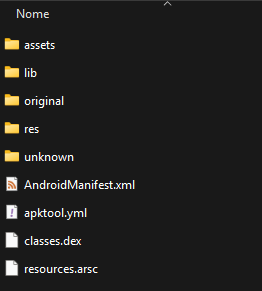

Setting up an environment for the client decompilation
========================================================

.. important::

    Building under Windows is not possible (as viking doesn't work on Windows), if you are under Windows,
    please use a Windows Subsystem for Linux (WSL) Ubuntu instance.

.. important::
    All commands here are executed trough a Bash shell.

Requirements
--------------

* Python 3.6 or newer with pip (or a virtual env with pipx)
* Ninja
* CMake 3.30+
* A C++ toolchain (for compiling the Rust tools)
* `A Rust toolchain <https://www.rust-lang.org/tools/install>`_
* wget and p7zip
* The following Python modules (you can install them with pip install ..):

    capstone colorama cxxfilt pyelftools ansiwrap watchdog python-Levenshtein toml

* A Java runtime (like OpenJDK 21)
* `APKTool <https://apktool.org/docs/install>`_

.. note::

    On Ubuntu, you can install everything except the Rust toolchain and apktool by running the following commands::

        sudo apt install python3 ninja-build cmake clang libssl-dev pkg-config build-essential openjdk-21-jre wget p7zip
        pip install capstone colorama cxxfilt pyelftools ansiwrap watchdog python-Levenshtein toml

Clong the repository
---------------------

Using git, clone the `client <https://github.com/decompfrontier/client>`_ repository with the following command::

    git clone --recurse-submodules https://github.com/decompfrontier/client

Dumping the executable and data files
----------------------------------------

You will first need to get an original copy of Brave Frontier for Android (sg.gumi.bravefrontier) for ARM version 2.19.6.0. If you have
Brave Frontier installed on your phone, you can use apps like APK Manager to get the APK file.

The SHA256 of the file should match: `BFE8D2141280AC51DEBDD819EC0BEBBC6844BF8249474D9FBDF361F8192B8241`.

Run the following command to extract the APK file::

    java -jar apktool.jar d -o apkunpack -s -r "brave frontier apk.apk"

You should see a directory called "apkunpack" in the same directory where you have run apktool, your apkunpack directory should look something like this:

From this directory, only two directories are important for this tutorial, "assets" and "lib".

Copy the whole content of the "assets" directory inside the "data" directory of the decompfrontier client.

Your data directory should look like so:

.. image::
    ../../images/decomp-setup/datadir.png

Next, copy the "libgame.so" file from the apkunpack/lib/arm64-v8a directory to the replika/romset/android/global/arm64-v8a directory.

The SHA256 of libgame.so **MUST BE** `076C8ED12E84D122938255C1530A4D4B1853D876B5928DD0C2389538FC4CAD95`.

Setting up the repository
----------------------------

Go to the client directory that we cloned previously and type:

    ./setup.sh

The following command will download the Android NDK r21e required for building brave frontier, if everything has gone successfully
you should see an `OK`. (Altrought sometimes you might see `Error: found at least one error` which is ok as well).

If you never installed any Android SDK (the script will check for the existance of the environment variable
`ANDROID_SDK`), if will default the installation to `~/android-sdk`

Make sure to update your `~/.bashrc` to add the following line if you have never setted up an android SDK:

    export ANDROID_SDK=~/android-sdk

Next steps
---------------

You are now ready to start decompiling, you can modify the files in the src directory and type `./make.sh` to compile the client
and `./diff.sh (your function)` to check if a function matches or not.
