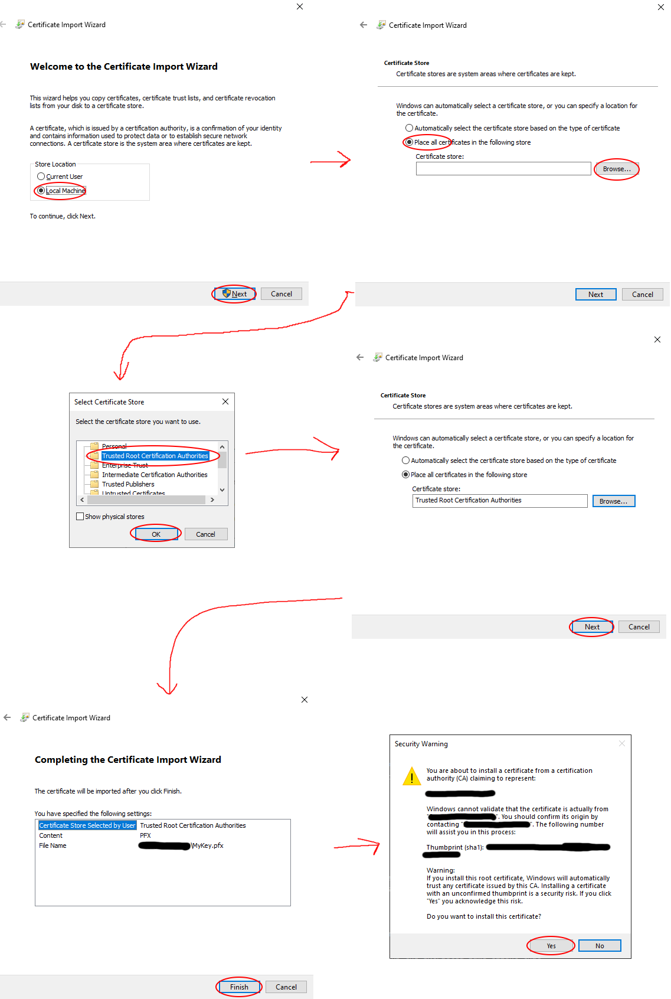
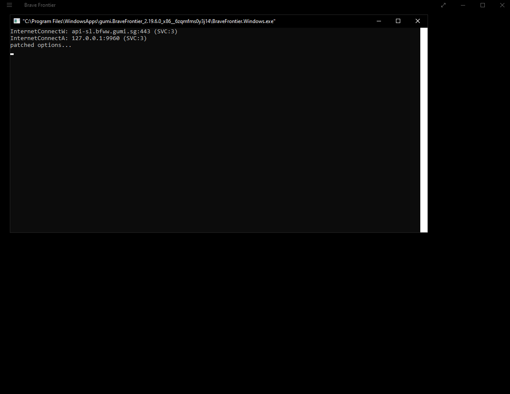

Setting Up a Development Game Client (Windows 8.1+)
=======================================================

Requirements
------------

* Visual Studio or Visual Studio Build Tools installed on your system
* `Microsoft Visual C++ Runtime Package 12.0 for x86 <https://github.com/M1k3G0/Win10_LTSC_VP9_Installer/blob/master/Microsoft.VCLibs.120.00_12.0.21005.1_x86__8wekyb3d8bbwe.appx>`_
* A copy of the Brave Frontier package (APPX) for Windows (`Share Drive link <https://drive.google.com/file/d/1NB64gzQOe-QQx9fY0mkoZiCSfe3WlTYi/view?usp=sharing>`_)
* Developer Mode enabled on your system

.. warning::

   If Developer Mode is not installed or enabled in Windows, the proxy will not function, and you will not see the command prompt.

Cloning the Repository
----------------------

To clone the server repository, run the following command:

::

    git clone --depth=1 https://github.com/decompfrontier/server

Building the Proxy
------------------

.. warning::

   The client *only* supports 32-bit platforms. Ensure you use the MINGW32 (i686-w64-mingw32) toolchain.

Using CMake, configure the proxy with one of the following options:

* For Visual Studio as your compiler: ``cmake --preset debug-vs``
* For MSYS/MinGW as your compiler: ``cmake --preset debug-mingw``

After compilation, navigate to your CMake build directory. Inside the ``bin`` folder, you should find a ``libcurl.dll`` file. Keep track of this file, as it will be required later in the tutorial.

Generating UWP Development Certificates
---------------------------------------

.. warning::

   It is recommended to remove these certificates when they are no longer needed to prevent them from compromising system trust.

.. important::

   All commands in this section must be executed in PowerShell. Ensure you are using PowerShell, or the system will not recognize the required applications.

.. note::

   If you have previously generated a PFX certificate for deploying applications to the Windows Store or have already completed this section, skip ahead to the "Modifying Brave Frontier APPX" section.

.. hint::

   This section provides a simplified process adapted from `this MSDN page <https://learn.microsoft.com/en-us/windows/msix/package/create-certificate-package-signing>`_.

To install custom Windows Store apps, you must first generate a development certificate. Run the following command in PowerShell to create a certificate:

::

    New-SelfSignedCertificate -Type Custom -Subject "CN=<Name>" -KeyUsage DigitalSignature -FriendlyName "Your friendly name goes here" -CertStoreLocation "Cert:\CurrentUser\My" -TextExtension @("2.5.29.37={text}1.3.6.1.5.5.7.3.3", "2.5.29.19={text}")

.. note::

   Replace ``<Name>`` with a name of your choice (e.g., "My BraveFrontier"). Write down this name, as it will be needed later.

Take note of the certificate's **Thumbprint**, as it will be used to export the certificate. Then, run the following commands to export it:

::

    $password = ConvertTo-SecureString -String "<Your Password>" -Force -AsPlainText
    Export-PfxCertificate -cert "Cert:\CurrentUser\My\<Certificate Thumbprint>" -FilePath MyKey.pfx -Password $password

.. note::

   - Replace ``<Your Password>`` with a strong password of your choosing.

   - Replace ``<Certificate Thumbprint>`` with the Thumbprint from the previous step.

You should now have a ``MyKey.pfx`` file. Keep this file safe, as it will be used to sign the modified Brave Frontier client.

Installing the Certificate
~~~~~~~~~~~~~~~~~~~~~~~~~~

1. Open the ``MyKey.pfx`` file to launch the Certificate Import Wizard.
2. Select ``Local Machine`` and proceed.
3. When prompted for the certificate store, choose ``Place all certificates in the following store``.
4. Browse and select ``Trusted Root Certification Authorities``.
5. Click ``Finish``, then confirm with ``Yes`` when prompted.

Modifying Brave Frontier APPX
-----------------------------

.. important::

   All commands in this section must be executed in a Developer Command Prompt for Visual Studio. Ensure you use this environment, or the required tools will not be recognized.

To unpack the game client, run the following command:

::

    makeappx unpack /p gumi.BraveFrontier_2.19.6.0_x86__tdae4wqex79w6.appx /d BraveFrontierAppxClient

A new folder named ``BraveFrontierAppxClient`` will be created, containing the extracted game client files for modification.

1. Copy the ``libcurl.dll`` file from the "`Building the Proxy <https://github.com/decompfrontier/offline-proxy>`_" section and place it in the root of the ``BraveFrontierAppxClient`` directory. When prompted to replace the original file, select ``Yes``.
2. Delete the following files from the ``BraveFrontierAppxClient`` directory:

   - ``AppxMetadata``

   - ``AppxSignature.p7x``

   - ``AppxBlockMap.xml``

   - ``ApplicationInsights.config``

3. Open ``AppxManifest.xml`` in a text editor (e.g., Notepad++) and locate this line:

   ::

       <Identity Name="gumi.BraveFrontier" Publisher="CN=5AA816A3-ED94-4AA2-A2B4-3ADDA1FABFB6" Version="2.19.6.0" ProcessorArchitecture="x86" />

   Replace ``CN=5AA816A3-ED94-4AA2-A2B4-3ADDA1FABFB6`` with ``CN=<Name>``, where ``<Name>`` matches the name used during certificate generation (e.g., "My BraveFrontier"). This ensures the application installs correctly.

4. (Optional) Modify the ``Properties`` tag to customize the app’s display details, such as:

   ::

       <Properties>
           <DisplayName>Brave Frontier</DisplayName>
           <PublisherDisplayName>株式会社gumi</PublisherDisplayName>
           <Logo>Assets\StoreLogo.png</Logo>
       </Properties>

5. (Optional) To change the app’s name in the Windows Start menu, edit this tag:

   ::

       <m2:VisualElements DisplayName="Brave Frontier"

6. Save and close the file.

Next, pack and sign the modified client with these commands:

::

    makeappx pack /d BraveFrontierAppxClient /p BraveFrontierPatched.appx
    SignTool sign /a /v /fd SHA256 /f MyKey.pfx /p "<Your Password>" BraveFrontierPatched.appx

.. note::

   Replace ``<Your Password>`` with the password used when exporting the certificate.

Running the Game
----------------

Install the newly generated ``BraveFrontierPatched.appx`` file and launch the client. If all steps were followed correctly, a console window should appear alongside the game client, as shown below:

.. warning::

   If no console appears, check the following:
   
   - Ensure the patched ``libcurl.dll`` was correctly installed.

   - Verify you did not use the ``deploy`` preset, as it is not supported in this build.

   - Confirm Developer Mode is enabled on your Windows PC.

Connecting to the Server
~~~~~~~~~~~~~~~~~~~~~~~~

Due to a default limitation in UWP apps, they cannot communicate with localhost, preventing the game from connecting to the server. To resolve this:

1. Download the `Enable Loopback Utility <https://telerik-fiddler.s3.amazonaws.com/fiddler/addons/enableloopbackutility.exe>`_.
2. Run the utility and select the Brave Frontier application.
3. Configure it as shown below, then click ``Save Changes`` and restart the game:

.. image::
    ../../images/dev-client-winrt/loopback_win.png

If the game server is running, you should now see the Brave Frontier login screen upon launching the game.
