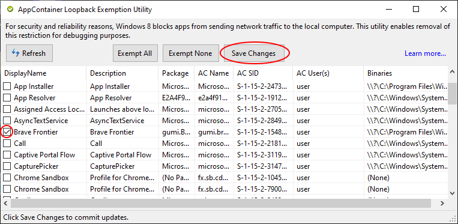

.. _dev-client-winrt:

.. role:: raw-html(raw)
   :format: html

Setting Up a Development Game Client (Windows 8.1+)
====================================================

.. contents::
   :local:

Introduction
-------------

This tutorial guides you through setting up a development game client for Brave Frontier on Windows 8.1 and later, enabling offline play via a local proxy server. It assumes you have Visual Studio 2022 installed with the Desktop development with C++ workload and the Windows 10 SDK. The process involves cloning the repository, building the proxy, generating certificates, modifying the game client, and enabling loopback for local testing.

.. note::
   If you are brand new to development, follow the exact folder structure shown in this tutorial (e.g., creating a folder named BF under your user profile directory). This will make storage and following along easier. You are free to use any folder structure you are comfortable with, but adjust paths in commands accordingly.

Requirements
-------------

.. warning::
   If Developer Mode is not installed or enabled in Windows, the proxy will not function, and you will not see the command prompt.

- Windows 8.1 or later
- Visual Studio 2022 with Desktop development with C++ workload and Windows 10 SDK
- Microsoft Visual C++ Runtime Package 12.0 for x86 (from https://github.com/M1k3G0/Win10_LTSC_VP9_Installer/blob/master/Microsoft.VCLibs.120.00_12.0.21005.1_x86__8wekyb3d8bbwe.appx)
- Git for Windows
- Administrator privileges

Cloning the Repository
-----------------------

To clone the offline-proxy repository, open PowerShell and run the following command:

.. code-block:: console

   cd $env:USERPROFILE\BF
   git clone --depth=1 https://github.com/decompfrontier/offline-proxy
   cd $env:USERPROFILE\BF\offline-proxy

.. note::
   The `$env:USERPROFILE` variable automatically points to your user directory (e.g., `C:\Users\YourUsername`). Adjust the path if you use a different structure.

Building the Proxy
-------------------

.. warning::
   The client only supports 32-bit platforms. Ensure the build targets Win32.

First, configure the project to generate the necessary solution file (`.sln`):

.. code-block:: console

   cmake --preset debug-vs

This command uses the Visual Studio preset to set up the project for a Debug build, creating the `.sln` file. If you encounter issues (e.g., "CMakePresets.json not found"), ensure your Visual Studio environment is correctly installed, or proceed manually with `cmake -G "Visual Studio 17 2022" -A Win32`.

Build the proxy using the following steps:

.. code-block:: console

   cmake --build . --config Debug

If the build fails, open ``offline-proxy.sln`` in Visual Studio 2022, set the solution platform to Win32 and configuration to Debug, then build (F7 or, with an "Fn Lock" keyboard, ``Fn`` + ``F7``). After a successful build, locate ``libcurl.dll`` in ``$env:USERPROFILE\BF\offline-proxy\bin\libcurl.dll`` (or search the bin folder).

Generating UWP Development Certificates
----------------------------------------

Generate a development certificate to sign the modified client:

.. code-block:: powershell

   $certName = "MyBraveFrontier"
   $friendlyName = "Brave Frontier Dev Cert"
   New-SelfSignedCertificate -Type Custom -Subject "CN=$certName" -KeyUsage DigitalSignature -FriendlyName "$friendlyName" -CertStoreLocation "Cert:\CurrentUser\My" -TextExtension @("2.5.29.37={text}1.3.6.1.5.5.7.3.3", "2.5.29.19={text}")

.. note::
   The output will show a Thumbprint (e.g., ``ABC123...``). Highlight the first line of the output (starting with "Thumbprint") with your mouse, right-click to copy, then paste it into the next command using right-click paste. Use arrow keys (up/down/left/right) to navigate and edit the ``$thumbprint`` variable. This is a basic CLI skill: right-click pastes copied text, and arrow keys move the cursor without needing the mouse.

Export the certificate:

.. code-block:: powershell

   $thumbprint = "ABC123..."  # Paste and edit your Thumbprint here using right-click paste and arrow keys
   $password = ConvertTo-SecureString -String "YourStrongPassword" -Force -AsPlainText  # Change password
   Export-PfxCertificate -cert "Cert:\CurrentUser\My\$thumbprint" -FilePath $env:USERPROFILE\BF\MyKey.pfx -Password $password

Install the certificate:

#. Double-click ``$env:USERPROFILE\BF\MyKey.pfx`` to launch the Certificate Import Wizard.
#. Select ``Local Machine`` and proceed.
#. Choose ``Trusted Root Certification Authorities`` as the store.
#. Click ``Finish``, then confirm with ``Yes``.

.. warning::
   Remove these certificates when you are done with Brave Frontier development to prevent compromising system trust. Removing the certificate after installing the patched BraveFrontier APPX is a safety step and will prevent launching the patched APPX if it relies on ongoing verification.

.. important::
   All commands must be executed in PowerShell with administrator privileges.

Obtaining the APPX File
------------------------

Download the unmodified Brave Frontier APPX file from the provided link:

- URL: https://drive.google.com/file/d/1NB64gzQOe-QQx9fY0mkoZiCSfe3WlTYi/view?usp=sharing
- Save as: ``$env:USERPROFILE\BF\BraveFrontier_2.19.6.0_x86.appx`` (right-click link > Save As).

.. note::
   Verify the file size (~100MB) to ensure integrity. This file is not publicly hosted elsewhere; direct downloads are rare and often risky (e.g., APKs from APKPure/BlueStacks). If issues arise, extract from an installed app: ``Get-AppxPackage *BraveFrontier* | Export-AppxPackage -Path $env:USERPROFILE\BF\BraveFrontier.appx``.

Modifying Brave Frontier APPX
------------------------------

Unpack and modify the APPX file using Developer PowerShell for Visual Studio 2022:

.. code-block:: console

   makeappx unpack /p $env:USERPROFILE\BF\BraveFrontier_2.19.6.0_x86.appx /d $env:USERPROFILE\BF\BraveFrontierAppxClient

.. note::
   Launch "Developer PowerShell for Visual Studio 2022" from the Start menu to ensure SDK access.

Copy the proxy library:

.. code-block:: console

   Copy-Item $env:USERPROFILE\BF\offline-proxy\bin\libcurl.dll $env:USERPROFILE\BF\BraveFrontierAppxClient -Force

Delete unnecessary files:

.. code-block:: console

   Remove-Item $env:USERPROFILE\BF\BraveFrontierAppxClient\AppxMetadata -Recurse -Force
   Remove-Item $env:USERPROFILE\BF\BraveFrontierAppxClient\AppxSignature.p7x, $env:USERPROFILE\BF\BraveFrontierAppxClient\AppxBlockMap.xml, $env:USERPROFILE\BF\BraveFrontierAppxClient\ApplicationInsights.config -Force

Edit the manifest:

#. Open ``$env:USERPROFILE\BF\BraveFrontierAppxClient\AppxManifest.xml`` in Notepad++.
#. Locate the line: ``<Identity Name="gumi.BraveFrontier" Publisher="CN=5AA816A3-ED94-4AA2-A2B4-3ADDA1FABFB6" ... />``.
#. Replace the Publisher CN with ``CN=MyBraveFrontier``.
#. (Optional) Update ``DisplayName`` to "Brave Frontier Offline" under ``<Properties>``.
#. Save and close.

.. important::
   All commands must be executed in Developer PowerShell for Visual Studio 2022.

Packing and Signing the Modified Client
-----------------------------------------

Pack and sign the modified APPX in Developer PowerShell for Visual Studio 2022:

.. code-block:: console

   makeappx pack /d $env:USERPROFILE\BF\BraveFrontierAppxClient /p $env:USERPROFILE\BF\BraveFrontierPatched.appx
   SignTool sign /a /v /fd SHA256 /f $env:USERPROFILE\BF\MyKey.pfx /p "YourStrongPassword" $env:USERPROFILE\BF\BraveFrontierPatched.appx

.. note::
   Ensure the password matches the one used during certificate export.

Running the Game
-----------------

Install the patched client:

.. code-block:: powershell

   Add-AppxPackage $env:USERPROFILE\BF\BraveFrontierPatched.appx

Enable loopback for local server communication:

#. Download the Enable Loopback Utility: https://telerik-fiddler.s3.amazonaws.com/fiddler/addons/enableloopbackutility.exe
#. Run the utility and select "Brave Frontier".
#. Check "Enable loopback" and click "Save Changes".
#. If an error occurs, enable Device Portal in Settings > Update & Security > For developers and disable "Restrict to loopback connections only".

Launch the game by searching "Brave Frontier" in the Start menu. A console window should appear alongside the client.

.. image:: ../../images/dev-client-winrt/bf_appx_patched.png
   :alt: Running the Patched Game Client

.. warning::
   If no console appears, verify the following:
   
   - The patched ``libcurl.dll`` was correctly installed.
   - Developer Mode is enabled on your Windows PC.

Connecting to the Server
--------------------------

Run the standalone server (e.g., ``standalone_frontend.exe`` from prior server automation) on ``127.0.0.1:9960``. With the loopback utility configured, the game should connect to the local server and display the login screen.

Troubleshooting
----------------

- **Build Fails**: Ensure Visual Studio 2022 C++ workload is installed. Rebuild in VS if needed.
- **Unpack Error**: Verify the APPX path and Developer PowerShell for Visual Studio 2022 usage.
- **Signing Error**: Check certificate installation and password.
- **No Console**: Confirm DLL replacement and Developer Mode.
