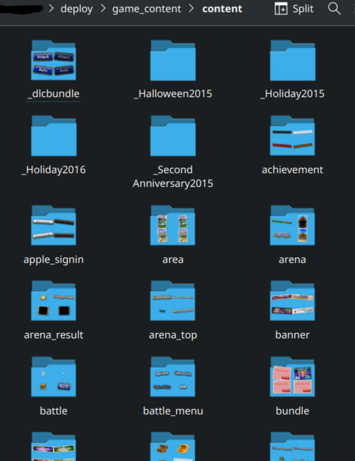

Setting up a development game server
================================================

Requirements
-----------------------

* A C++17 or greater compiler (like Visual Studio or GCC)
* CMake
* vcpkg
* git
* A way to launch the game client (see below for the supported methods)

Cloning the repo
-----------------------

Clone the server repository:
    git clone --depth=1 https://github.com/decompfrontier/server

Setting up vcpkg
-------------------------

Clone the `vcpkg repository <https://github.com/microsoft/vcpkg>`_ and bootstrap vcpkg:
    bootstrap-vcpkg -disableMetrics

.. admonition:: Windows-only extra steps

    You also need to open an elevated command prompt and type `vcpkg integrate install` in your
    vcpkg directory.

Setup an system or user environment variable called `VCPKG_ROOT` which points to your vcpkg installation directory.

Setting up the server
-----------------------------

Using cmake, select the preset `Development config for XXXXX (64-bit)` depending on your operative system. (or use cmake --preset debug-win64, debug-lnx64 or debug-osx64)

Configure and then generate the target project.

Once you build the project, you will have a binary called "gimuserverw", this binary is your
development start that you should run and debug to develop new functionalities.

Download the assets `21900.zip <https://drive.google.com/file/d/1ApVcJISPovYuWEidnkkTJi_NI8sD1Xmx/view>`_  to your `server repository/deploy/system/game_server` (if the folder does not exist create it)

Extract `assets.zip` from the `21900.zip` like so:

.. image:: ../../images/archive_21900.png

Open `assets.zip` and inside, extract the two folders (`content` and `mst`) inside the `deploy/game_content`:

.. image:: ../../images/assets_zip.png

You should have two folders called `content` and `mst` inside the `game_content` folder, like so:

.. image:: ../../images/servercontent_root.png

The content of the `content` folder should contain the following assets:

The content of the `mst` folder should contain the following assets:

.. image:: ../../images/servercontent_mst.png

You can modify the server configuration by editing the JSON files contained inside the `system` directory,
you can also setup extra settings inside the `gimuconfig.json` and adjust Drogon-specific settings inside the `config.json`.

You should now have an environment ready to begin developing the Brave Frontier emulator.
