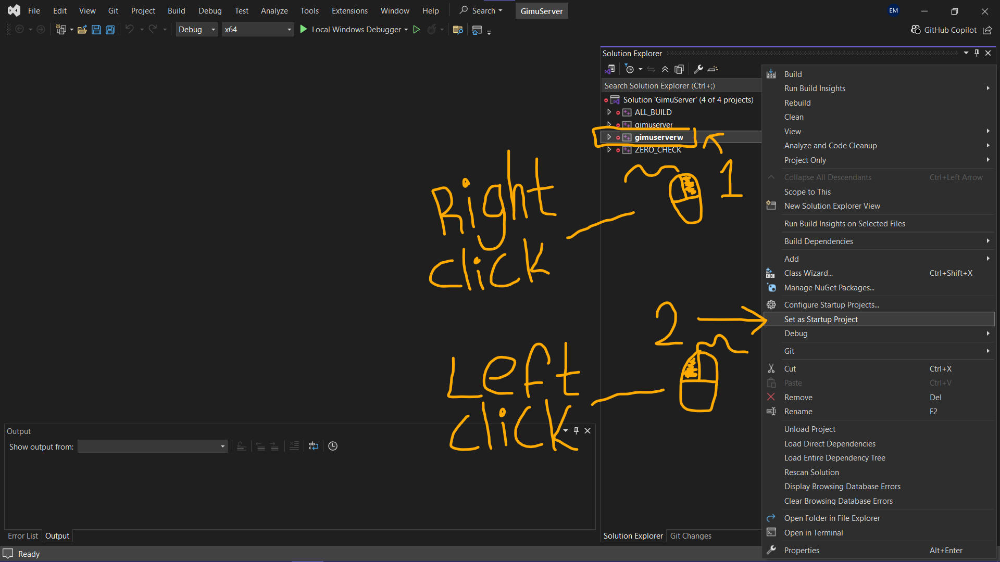
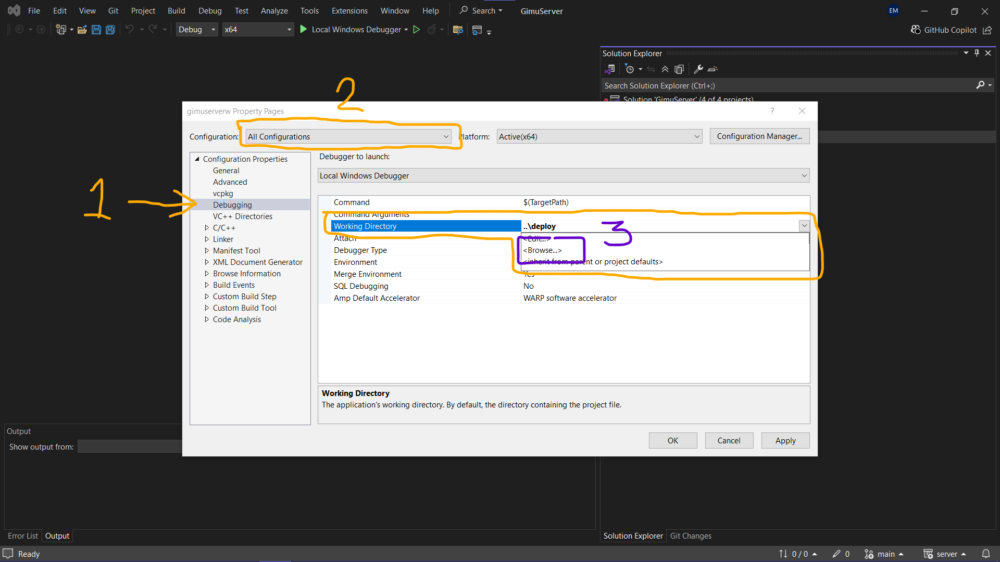
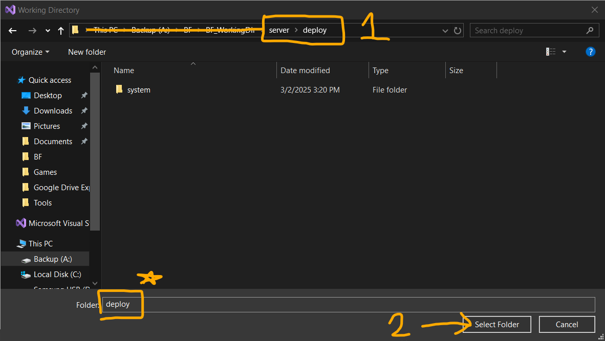

Setting Up a Development Game Server
======================================

This guide walks you through the chronological steps to set up a development environment for the Brave Frontier emulator server, ensuring all prerequisites are met and potential issues are avoided from the start.

Installing Visual Studio 2022 Community with C++ for Developers
----------------------------------------------------------------

Before cloning the server repository or setting up dependencies, install Visual Studio 2022 Community with the necessary C++ development tools to prevent common build errors, such as the ``missing rc.exe`` issue.

**Steps**:

1. Download and install Visual Studio 2022 Community from `https://visualstudio.microsoft.com/downloads/`. (For best results, run the installer with Admin Privileges)

2. During installation, select the following in the Visual Studio Installer:

   - **Workload**: "Desktop development with C++" (ensure this is checked).
   - **Individual Components** (under "Installation details"):

     - "Windows 10 SDK" (select the latest version, e.g., 10.0.22621.0).
     - "MSVC v143 - VS 2022 C++ x64/x86 build tools." (Usually selected by default)

   .. image:: ../../images/dev-server/VisualStudio2022COptions.png

3. Click "Install while downloading" or "Modify" to apply changes (approximately 10.7 GB of additional space may be required).

.. note::
   To verify all files are installed correctly, you can modify your Visual Studio installation at any time using the Visual Studio Installer. Open the installer, select "Modify" for Visual Studio 2022 Community, and ensure the above components are checked. This step can help confirm the presence of critical tools like ``rc.exe``, which is necessary for building C++ projects.

Cloning the Server Repository
------------------------------

Clone the server repository to begin working on the Brave Frontier emulator server.

**Steps**:

To clone the server repository, run the following command in a terminal (e.g., Git Bash, Command Prompt, or PowerShell):

::

   git clone --depth=1 https://github.com/decompfrontier/server

.. note::
   Ensure Git is installed on your system (a base installation is all you need).

Setting Up vcpkg
-----------------

Set up `vcpkg`, a C++ library manager, to handle dependencies for the server project.

**Steps**:

1. Clone the `vcpkg` repository and bootstrap it with metrics disabled:

   - In a terminal, run:

     ::

        git clone https://github.com/microsoft/vcpkg.git
        cd vcpkg
        .\bootstrap-vcpkg -disableMetrics  (for Windows, PowerShell)
        ./bootstrap-vcpkg.sh -disableMetrics  (for Linux/macOS)

.. admonition:: Windows-Only Extra Steps

   On Windows, open an elevated PowerShell (Run as Administrator) and run the following command in your `vcpkg` directory:

   ::

      .\vcpkg integrate install

2. Set up a permanent environment variable named ``VCPKG_ROOT`` pointing to your `vcpkg` installation directory. Choose one of the following methods based on your preference:

   - **User-Level (Recommended)**: Sets the variable for your user account only. In a PowerShell terminal, run:

     ::

        [Environment]::SetEnvironmentVariable("VCPKG_ROOT", "C:\Projects\vcpkg", "User")

   - **System-Level (Admin Required)**: Sets the variable for all users on the system. In an elevated PowerShell (Run as Administrator), run:

     ::

        [Environment]::SetEnvironmentVariable("VCPKG_ROOT", "C:\Projects\vcpkg", "Machine")

   - Replace ``C:\Projects\vcpkg`` with the actual path to your `vcpkg` folder (e.g., ``A:\BF\vcpkg`` if that’s where it’s located).
   - To verify it worked, restart your terminal and run:

     ::

        $env:VCPKG_ROOT

     Example Output: ``C:\Projects\vcpkg``

   - Alternatively, set it via the GUI:

     - Open `sysdm.cpl` (via `Windows Key + R`), go to “Advanced” > “Environment Variables.”
     - Under “User variables” (for user-level) or “System variables” (for system-level, admin required), click “New”:

       - Variable name: ``VCPKG_ROOT``
       - Variable value: Your `vcpkg` path (e.g., ``C:\Projects\vcpkg``).

.. important::
   Setting ``VCPKG_ROOT`` permanently is required for this and subsequent tutorials. Ensure you choose the method (user-level or system-level) that best suits your setup to avoid issues later.

Building the Server Using CMake
--------------------------------

Configure and build the server project using CMake with a preset for your operating system.

**Steps**:

Open Visual Studio Community 2022 and select open project (Using CMake option).

This will prompt you to select the CMakeList.txt file of your project.

Select the CMakeList.txt file located in the root of your ``server`` directory and wait about 5 - 10 minutes for this to build.

Once built, you’ll find a binary named ``gimuserverw`` in the ``server\standalone_frontend`` folder. This is your development server executable, which you can run and debug to implement new features.

.. hint::
   At this point, if there are no errors in the console, you are free to close the admin PowerShell (and remove VCPKG_ROOT from root)

Double Click ``gimuserverw.vcxproj`` to open Visual Studio 2022 Community.

In Visual Studio 2022 Community, right click ``gimuserverw`` in the Solution Explorer pane and select ``Set as Startup Project``.

From here, select the ``Debug`` dropdown menu in the top ribbon. Select ``gimuserverw Debug Properties`` at the bottom of the dropdown.

.. image:: ../../images/dev-server/SettingUpTheServer2.png

In this pop-up window, select ``Debugging`` under ``Configuration Properties``, Change ``Configuration:`` dropdown to ``All Configurations``, then change ``Working Directory`` to the ``server\deploy`` folder. Click ``OK`` to close this window, then click ``Apply`` and finally ``OK`` to return to Visual Studio 2022 Community.

Final Stretch
--------------

Complete the server setup by downloading and organizing assets.

**Steps**:

1. Download the assets from `21900.zip <https://drive.google.com/file/d/1ApVcJISPovYuWEidnkkTJi_NI8sD1Xmx/view>`_.

2. Extract ``assets.zip`` from ``21900.zip`` as shown below:

   .. image:: ../../images/dev-server/archive_21900.png

3. Open ``assets.zip`` and extract the ``content`` and ``mst`` folders into ``deploy/game_content`` (if this folder doesn't exist make it):

   .. image:: ../../images/dev-server/assets_zip.png

   After extraction, you should have two folders, ``content`` and ``mst``, inside ``game_content``:

   .. image:: ../../images/dev-server/servercontent_root.png

   The ``content`` folder should contain the following assets:

   .. image:: ../../images/dev-server/servercontent_content.png

   The ``mst`` folder should contain these assets:

   .. image:: ../../images/dev-server/servercontent_mst.png

4. Modify the server configuration by editing the JSON files in the ``system`` directory. You can also adjust additional settings in ``gimuconfig.json`` and tweak Drogon-specific options in ``config.json``.

Your environment is now fully set up and ready for developing the Brave Frontier emulator. You can run the server by clicking the ``Green Filled-in Play Button`` at the top of Visual Studio 2022 Community.

What's next?
-------------

.. important::
   Now that you are done with the server set-up, please make your way over to game client set-up for installation steps.

.. note::
   If you encountered an error in set-up or a bug is preventing you from progressing in one of these tutorials, please create an ``Issue`` on the main repo. Thanks for your interest in our project!
